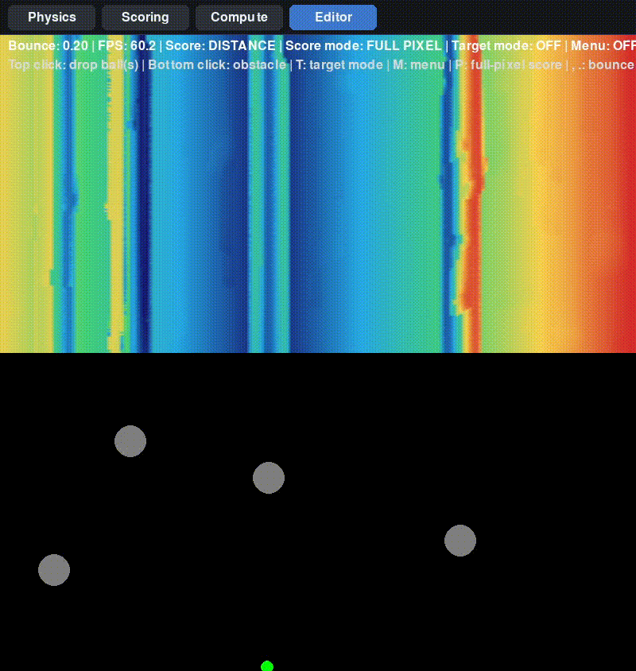

# Loss Landscape

A small interactive Pygame sandbox to visualize a ball-drop loss landscape.

## Run

1. Install dependencies:

   pip install -r requirements.txt

2. Start the app:

   python main.py

## Demo

